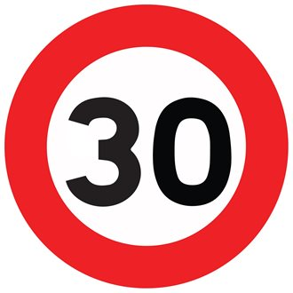

# **Traffic Sign Recognition** 

## Writeup

### You can use this file as a template for your writeup if you want to submit it as a markdown file, but feel free to use some other method and submit a pdf if you prefer.

---

**Build a Traffic Sign Recognition Project**

The goals / steps of this project are the following:
1.Load the data set
2.Explore, summarize and visualize the data set
3.Design, train and test a model architecture
4.Use the model to make predictions on new images
5.Analyze the softmax probabilities of the new images
6.Summarize the results with a written report

[//]: # (Image References)

[image1]: ./examples/visualization.jpg "Visualization"
[image2]: ./examples/grayscale.jpg "Grayscaling"
[image3]: ./examples/random_noise.jpg "Random Noise"
[image4]: ./examples/placeholder.png "Traffic Sign 1"
[image5]: ./examples/placeholder.png "Traffic Sign 2"
[image6]: ./examples/placeholder.png "Traffic Sign 3"
[image7]: ./examples/placeholder.png "Traffic Sign 4"
[image8]: ./examples/placeholder.png "Traffic Sign 5"

## Rubric Points
### Here I will consider the [rubric points](https://review.udacity.com/#!/rubrics/481/view) individually and describe how I addressed each point in my implementation.  

---
### Writeup / README

#### 1. Provide a Writeup / README that includes all the rubric points and how you addressed each one. You can submit your writeup as markdown or pdf. You can use this template as a guide for writing the report. The submission includes the project code.

Zip file contains all necessary documentation.

### Data Set Summary & Exploration

#### 1. Provide a basic summary of the data set. In the code, the analysis should be done using python, numpy and/or pandas methods rather than hardcoding results manually.

I used the numpy library to calculate summary statistics of the traffic
signs data set:

* The size of training set is 34799
* The size of the validation set is 4410
* The size of test set is 12630
* The shape of a traffic sign image is 32x32x3
* The number of unique classes/labels in the data set is 43

#### 2. Include an exploratory visualization of the dataset.

Here is an exploratory visualization of the data set. It is one of the images in the dataset.

### Design and Test a Model Architecture

#### 1. Describe how you preprocessed the image data. What techniques were chosen and why did you choose these techniques? Consider including images showing the output of each preprocessing technique. Pre-processing refers to techniques such as converting to grayscale, normalization, etc. (OPTIONAL: As described in the "Stand Out Suggestions" part of the rubric, if you generated additional data for training, describe why you decided to generate additional data, how you generated the data, and provide example images of the additional data. Then describe the characteristics of the augmented training set like number of images in the set, number of images for each class, etc.)

As a first step, I did NOT decide to convert the images to grayscale because I believe we could lose some important information in training the model 

Next, I normalized the image data because neural networks work better with normalization. I shuffled the data as well since we require the data to be randomly distributed. Note : X_train=(X_train-128)/128

I did not generate additional data because the model worked well with the existing architecture on the test images.  

#### 2. Describe what your final model architecture looks like including model type, layers, layer sizes, connectivity, etc.) Consider including a diagram and/or table describing the final model.

My final model consisted of the following layers:

| Layer         		|     Description	        					| 
|:---------------------:|:---------------------------------------------:| 
| Input         		| 32x32x3 RGB image   							| 
| Convolution 5x5     	|1x1 stride, valid padding, outputs=(28, 28, 6) 	|
| RELU					| 											|
| Max pooling	      	| 2x2 stride,  outputs 14x14x6 				|
| Convolution 5x5	    |1x1 stride, valid padding, outputs=(10, 10, 16)
| RELU  
| Max pooling            2x2 stride,  outputs 5x5x16 
| Fully connected		| Flatten input=400,Output=120     									|
| RELU				            									|
|Fully connected		|Flatten input=120,Output=84												|
|RELU					|												|
|Fully connected		|Flatten input=84,Output=43												|
|Logits					|Wx+b												|
 

#### 3. Describe how you trained your model. The discussion can include the type of optimizer, the batch size, number of epochs and any hyperparameters such as learning rate.

To train the model, I used a batch size of 128,epochs=20 and a learning rate of 0.001.I used LeNet model as the architecture.I chose Adam optimizer since it performs better than SGD.I applied dropouts of probability 0.5 for training and 1.0 for evaluation.

#### 4. Describe the approach taken for finding a solution and getting the validation set accuracy to be at least 0.93. Include in the discussion the results on the training, validation and test sets and where in the code these were calculated. Your approach may have been an iterative process, in which case, outline the steps you took to get to the final solution and why you chose those steps. Perhaps your solution involved an already well known implementation or architecture. In this case, discuss why you think the architecture is suitable for the current problem.

My final model results were:
* training set accuracy of 99.4
* validation set accuracy of 95.1 
* test set accuracy of 93.8

LeNet was the architecture chosen.I have converted images to grayscale and the accuracy was lower than expected.Using a bigger network also resulted in slower performance.
Architecture was adjusted to a smaller network as discussed in the lecture slides.Images were left in RGB and not converted     to grayscale.It had 2 convolution and 2 pooling layers followed by 3 fully connected layers. Dropouts of probability 0.5 for training and 1.0 for evaluation and played a key role in achieving a validation accuracy >93.

Epochs were increased from 10 to 20 to achieve higher accuracy.Larger batch size was chosen intially but 128 seemed to be the optimum value. 
Dropout was an important choice which is a regularization technique for reducing overfitting in neural networks.The term "dropout" refers to dropping out units (both hidden and visible) in a neural network.

Convolutional neural nets are a specific type of deep neural net which are especially useful for image recognition. Specifically, convolutional neural nets use convolutional and pooling layers, which reflect the translation-invariant nature of most images
 

### Test a Model on New Images

#### 1. Choose five German traffic signs found on the web and provide them in the report. For each image, discuss what quality or qualities might be difficult to classify.

Here are five German traffic signs that I found on the web:

  
 

100% ACCURCACY on web images!!!!!!!
 

#### 2. Discuss the model's predictions on these new traffic signs and compare the results to predicting on the test set. At a minimum, discuss what the predictions were, the accuracy on these new predictions, and compare the accuracy to the accuracy on the test set (OPTIONAL: Discuss the results in more detail as described in the "Stand Out Suggestions" part of the rubric).

Here are the results of the prediction:

| Image			        |     Prediction	        					| 
|:---------------------:|:---------------------------------------------:| 
| Stop Sign      		| Stop Sign   									| 
| Turn-Left     			| Turn-Left 										|
| Yield					| Yield											|
| 30 km/h	      		| 30 km/h					 				|
| Road work			| Road work      							|

100 % Accuracy on the test Images.
The model was able to correctly guess 5 of the 5 traffic signs, which gives an accuracy of 100%. It means that the network seemed to capture all the information and the training method looks robust.However, this was tested on only 5 images which is limited.Stop,turn-left,yield,30km/h and road work were detected but the model might struggle with images containing pedestrians or signs from a different country.

#### 3. Describe how certain the model is when predicting on each of the five new images by looking at the softmax probabilities for each prediction. Provide the top 5 softmax probabilities for each image along with the sign type of each probability. (OPTIONAL: as described in the "Stand Out Suggestions" part of the rubric, visualizations can also be provided such as bar charts)

The model recognized all the images correctly with a softmax probability of 1.0.

| Probability         	|     Prediction	        					| 
|:---------------------:|:---------------------------------------------:| 
| 1         			| Stop sign   									| 
| 1     				| Turn-Left 										|
| 1					| Yield											|
| 1	      			| 30 km/h					 				|
| 1				    | Road work      							|

For the stop sign, the model predicted correctly with a probability of 1.0 and the rest were zeros.
Similarly with the other signs where the remaining were zero or numbers at the order of 10^-17 which of no significance.

### (Optional) Visualizing the Neural Network (See Step 4 of the Ipython notebook for more details)
#### 1. Discuss the visual output of your trained network's feature maps. What characteristics did the neural network use to make classifications?

